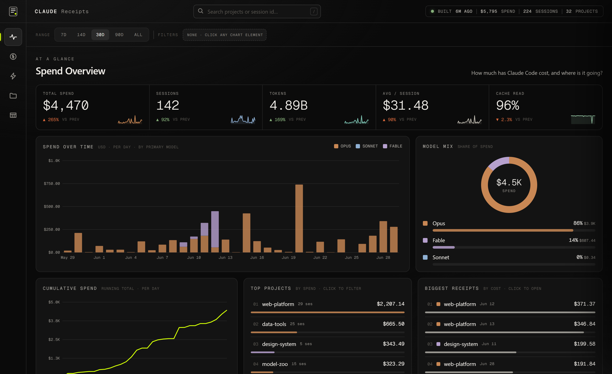

# Claude Receipts

> **Online-only fork.** Every Claude Code session ends with a thermal-printer-style
> receipt that opens in your browser — a breakdown of that session's spend by model,
> token counts, location, and weather. No physical printer, no third-party sharing.
> This fork also tweaks the receipt (project + branch in the header, weather in the
> footer) and adds a local **usage portal** that turns your whole receipt history into
> a spend dashboard.


## Usage portal

A local, read-only dashboard over your entire logbook — spend over time, model mix,
top projects, biggest receipts, and a searchable session explorer. All aggregation
runs client-side; nothing leaves your machine.



Run it from the `portal/` folder:

```bash
cd portal
npm install
npm run dev      # builds the data, then opens http://localhost:4179
```

On Windows you can just double-click `portal/Claude-Receipts.bat`. The portal reads
the per-session logbook shards (`logbook.d/`) written by the hook; point it at a
different copy with `CLAUDE_RECEIPTS_LOGBOOK=/path/to/logbook.csv` (an anchor
path — its sibling `logbook.d/` is what gets read).

## Installation

```bash
npx claude-receipts setup
```

This will:

- Configure the `SessionEnd` hook in your global `~/.claude/settings.json`
- Create a config file at `~/.claude-receipts.config.json`

From now on, every time you exit a Claude Code session, a receipt is generated and
opened in your browser.

### Manual generation

Generate a receipt for your most recent session:

```bash
npx claude-receipts generate
```

## Commands

### `generate`

Generate a receipt for a Claude Code session.

```bash
# Most recent session
npx claude-receipts generate

# Save styled HTML (this is what the hook does)
npx claude-receipts generate --output html

# Image / PDF (rendered via headless Chromium)
npx claude-receipts generate --output png,pdf

# A specific session by UUID prefix
npx claude-receipts generate --session 9356d5e2

# Override location
npx claude-receipts generate --location "Paris, France"
```

**Options:**

- `-s, --session <id>` - Generate for a specific session ID or UUID prefix
- `-o, --output <format>` - Output format: "html", "png", "pdf", or "console" (supports multiple, comma-separated or repeated)
- `-l, --location <text>` - Override location detection

**Output formats:**

- `html` - Beautiful styled receipt saved to `~/.claude-receipts/projects/`
- `png` - Rasterized receipt image (rendered via headless Chromium)
- `pdf` - PDF receipt (rendered via headless Chromium)
- `console` - ASCII art display in terminal

### `setup`

Configure automatic receipt generation.

```bash
# Run interactive setup
npx claude-receipts setup

# Uninstall the hook
npx claude-receipts setup --uninstall
```

This modifies `~/.claude/settings.json` to add a `SessionEnd` hook that automatically
generates receipts.

### `config`

Manage your receipt configuration.

```bash
# Show current configuration
npx claude-receipts config --show

# Set a configuration value
npx claude-receipts config --set location="Kuala Lumpur, Malaysia"
npx claude-receipts config --set timezone="Asia/Kuala_Lumpur"

# Reset to defaults
npx claude-receipts config --reset
```

**Available settings:**

- `location` - Default location (string)
- `timezone` - Timezone for dates (string, e.g., "Asia/Macau")

## Configuration

Configuration is stored at `~/.claude-receipts.config.json`.

**Default configuration:**

```json
{
  "version": "1.0.0"
}
```

**Optional settings:**

- `location` - Custom location string (otherwise auto-detected)
- `timezone` - Custom timezone for date formatting

### Location detection

Location is determined in this order:

1. `--location` flag (if provided)
2. Config file `location` setting
3. Auto-detection via IP geolocation (offline, using geoip-lite)
4. Fallback: "The Cloud"

## How it works

1. **SessionEnd hook**: when you exit Claude Code, it pipes the session id and transcript path to `claude-receipts generate --output html`.
2. **Cost, computed inline**: every assistant message in the transcript JSONL carries its own token usage and model id, priced from a built-in table in `src/core/pricing.ts`. No subprocess, no external indexer — the receipt is ready in about a second.
3. **Render + open**: a styled HTML receipt is generated and opened in your default browser (hook mode only).
4. **Logbook**: one row per session is appended to a logbook that the usage portal reads, so your whole history is summarizable across sessions.

## Requirements

- Node.js >= 20.0.0
- Claude Code (for automatic generation)

## Troubleshooting

### Hook not triggering

Check that the hook is installed:

```bash
cat ~/.claude/settings.json
```

You should see a `SessionEnd` hook pointing to `claude-receipts`. Diagnostic events
are appended to `~/.claude-receipts/hook.log` on every hook fire.

### A session renders at $0

Cost is computed from the transcript's per-message usage and a built-in price table.
When a brand-new Claude model ships before its price is added to `src/core/pricing.ts`,
those tokens bill at $0 until the entry is added (the miss is logged to `hook.log`).
Very short sessions with no model traffic legitimately have no cost.

### "Cannot determine transcript path"

You're trying to manually generate a receipt but the most recent session has no valid
project path. Either run from within a `SessionEnd` hook (use the `setup` command) or
work in a Claude Code session and let it auto-generate.

## Roadmap

- [x] HTML receipts with auto-open in browser
- [x] Console ASCII art mode
- [x] Accurate session cost tracking (computed inline from the transcript)
- [x] Session matching by UUID or prefix
- [x] Image export (PNG and PDF, via headless Chromium)
- [x] Local usage portal (spend dashboard over the logbook)
- [ ] Plugin for Opencode ([opencode issue](https://github.com/anomalyco/opencode/issues/10524))

## Credits

A digital-only fork of the original `claude-receipts` — the thermal-printer project
that started it all.

## License

MIT
