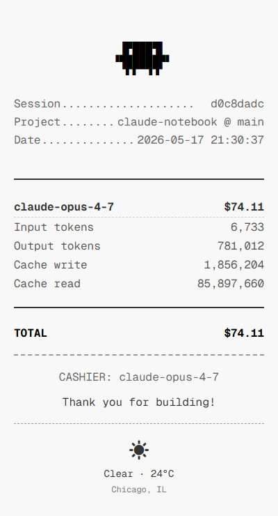

# Agent Usage Stat

A private, local portal for understanding how your coding agents use tokens, time, and API-equivalent cost.



## Supported

Agent Usage Stat supports:

- Windows and macOS
- Claude Code
- OpenAI Codex, including Codex sessions used through ChatGPT

It does not read general ChatGPT chats, Claude.ai chats, Linux sessions, or API-account usage. All data stays on your machine or in the folder you choose.

## Start

Node.js 20 or newer is required.

1. [Download or clone this repository](https://github.com/yiliangs/agent-usage-stat).
2. On Windows, double-click `Initialize-Agent-Usage-Stat.bat`. On macOS, double-click `Initialize-Agent-Usage-Stat.command`.
3. Choose the folder where usage data should be stored.

That folder is the only setting. The initializer detects the operating system and installed agents, installs a private runtime under your user profile, connects Claude Code and Codex automatically, and opens the portal.

Codex requires one security confirmation before it can run a new hook. If Codex asks, open `/hooks` and trust the Agent Usage Stat hook. This confirmation cannot be completed by the initializer.

Open a new terminal after setup. The normal `claude`, `codex`, and `claudex`
commands then print one verified status line after the agent exits:

```text
[Agent Usage Stat] Usage recorded: Claude, 18.6M tokens, my-project
```

The line appears in the same terminal, not in a popup. It is printed only after
the detached capture worker has completed its shard write and read-back check.
Use `agent-usage-stat setup --no-terminal-message` to keep silent capture without
shell command wrappers. The explicit fallback is
`agent-usage-stat run claude -- <arguments>`, with `codex` or `claudex` accepted
in place of `claude`.

After initialization, use the dedicated one-click portal launcher whenever you
want a fresh portal: `portal/Agent-Usage-Stat.bat` on Windows or
`portal/Agent-Usage-Stat.command` on macOS. It stops the previous local server,
reconciles local Codex turns into the configured `logbook.d/`, rebuilds the
browser data, and opens the portal.

## What you get

- Spend and token trends
- Claude Code and Codex comparisons
- Model, project, machine, and session breakdowns
- Cache read and write efficiency
- Searchable session details

Costs are API-equivalent list-price estimates. They are not charges added to a ChatGPT or Claude subscription.

Each completed session becomes one JSON file under `<your-folder>/logbook.d/`. You can use a synced folder to combine several Windows and macOS machines.

## Terminal alternative

```bash
npm install -g agent-usage-stat
agent-usage-stat setup
agent-usage-stat
```

`setup` asks for the data folder only. To change it later:

```bash
agent-usage-stat config --set dataRoot="<new-folder>"
```

## Development

```bash
npm install
npm install --prefix portal
npm test
```

Licensed under MIT.
